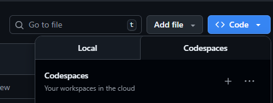

# Odoo Contabilidade - Docker Compose Setup

Este projeto facilita a implantação do Odoo usando Docker, Nginx e PostgreSQL.

## 1. Pré-requisitos

- **Docker Desktop** instalado e em execução no seu sistema.

## 2. Clonando o repositório

```bash
git clone https://github.com/Brunno-Bocardo/odoo-contabilidade.git
cd odoo-contabilidade
```

## 3. Subindo os containers

Para iniciar todos os serviços em segundo plano:
```bash
docker compose up -d
```

Para iniciar todos os serviços no GitHub Codespaces:
```bash
docker compose -f compose.codespaces.yml up -d --build
```

## 4. Acessando o Odoo

Após subir os containers, acesse o sistema pelo navegador:
```
http://localhost/web/login
```

## 5. Comandos úteis do Docker

- **Parar containers:**
	```bash
	docker compose down
	```
- **Reiniciar todos os serviços:**
	```bash
	docker compose restart
	```
- **Verificar status dos containers:**
	```bash
	docker ps
	```
- **Atualizar um módulo:**
	``` bash
	docker compose run --rm odoo odoo -c /etc/odoo/odoo.conf -u <MODULE_NAME> -d <DATA_BASE_NAME> --xmlrpc-port=9999 --db_host=db --db_user=odoo --db_pass=odoo --stop-after-init
	```
- **Ver os logs:**
	``` bash
	docker compose logs <serviço>
	docker compose logs odoo
	```

## 6. Disponibilizar o serviço usando o GitHub Codespaces


- Dentro do repositório, inicie o seu Codespaces;
- Certifique-se de subir o seu ambiente utilizando o `compose.codespaces.yml`;
- Vá até a aba "PORTAS" no seu terminal, e torne a porta 8069 pública;
- A URL dessa porta estará disponível;
- Em caso de erro, verifique os logs, ou execute o comando de atualizar o módulo `base` do seu banco de dados.


## 7. Dicas úteis

- Para criar novos módulos, crie um diretório em `addons`. Depois, adicione no `odoo.conf`, no parâmetro `addons_path`, o caminho até o diretório criado. Ficará dessa forma: `addons_path = /mnt/extra-addons,/mnt/extra-addons/<custom-addons>`
- Certifique-se de que as portas 80 (Nginx) e 5432 (PostgreSQL) estejam livres no seu sistema.
- Para facilitar o desenvolvimento e depuração, utilize a extensão ["Odoo Debug"](https://chromewebstore.google.com/detail/odoo-debug/hmdmhilocobgohohpdpolmibjklfgkbi) disponível para o navegador Chrome/Firefox. Ela adiciona funcionalidades extras à interface do Odoo, como modo debug, visualização de IDs e menus avançados. 


